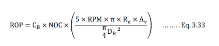
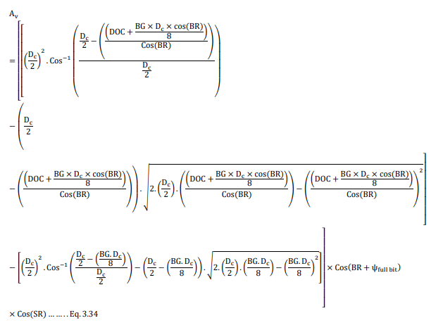
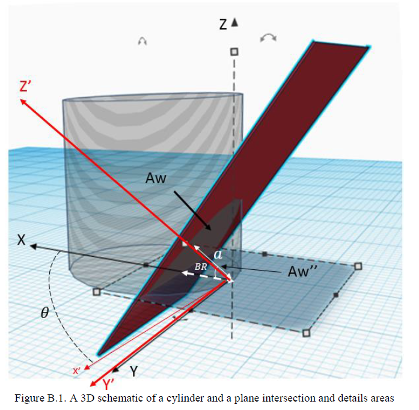

# Incorporating the Interfacial Friction Angle Concept into the PDC Single Cutter and Full Bit Modeling.

Find Dissertaion [here](https://shareok.org/bitstream/handle/11244/324806/Atashnezhad_okstate_0664D_16520.pdf?sequence=1).

ROP is a function of different parameters including WOB, RPM, hydraulic design, bit specifications, and other parameters. Parameters that influence on drilling rate of penetration (ROP) are seen at the following visualization.

  

**Authors:**
Amin Atashnezhad, 2019

**Description:**
Over the past century, oil and gas served an important role in the US energy sector. The oil industry continually has worked to reduce the drilling cost by increasing drilling efficiency. Drilling is a time-consuming and costly operation in which a wellbore is drilled into underground formations to extract the oil and gas from hydrocarbon reservoirs. In well construction, drilling cost is one of the main parts of the total well cost. According to the Energy Information Administration (EIA), the average drilling cost for an onshore well is about 26% of the total well costs (drilling, completion, and facilities), while for an offshore well, the cost rises to about 40% of the total well costs (EIA, 2016). As the energy demand increases in the world markets, oil companies are trying to access resources in more hostile environments, which often increases the time and cost of drilling. The objective of this study is to improve the ROP estimation for PDC bits by introducing a novel ROP model for hard rocks. The effect of cutter geometry and wear flat areas (both PDC and stud) are integrated into the new PDC ROP model. The interfacial friction angle models for single cutter and full bit are presented and used to improve the cutter force and ROP model estimation accuracy. A novel PDC wear model is developed based on the physical work done by the cutter which integrates both the PDC and stud wear coefficients. This research has numerous potential applications in the drilling industry such as: developing or integrating into current drilling optimization software, autonomous drilling decision making, real-time optimization, and problem solver software.

PDC ROP model is seen at the following Equations (check out page 55 in the Dissertation - asset folder).

  

  

The depth that a cutter penetrates into the rock, along its normal direction is known as depth of cut (DOC). The depth of cut is a function of cutter normal force, rock strength, and the area beneath the cutter. For a blunt cutter, the area beneath the cutter includes the area beneath the cutter face (Ah in Figure 3.1) and wear flat area (C-E in Figure 3.2), while for a sharp cutter it is only the area beneath the cutter face (Ah in Figure 3.1). In the following pages, the contact area equations for both sharp and blunt cutters are presented. The cutter front area (Av) is then calculated by taking the cutter contact area (Acontact) and cutter BR angle into account (check out dissertation page 39).

* Sharp PDC Cutter.

  

* Worn PDC Cutter.

  

**Cutter 3D view and wear flat areas**

In Figure B.1, a plane and a cylinder are shown. The plane intersected with the bottom side of the cylinder on the X-Y-Z coordinate. In Figure B.1, the Aw is the cutter wear flat area and the Aw′ is the projection of cutter wear flat area on the X-Y plane. Note that the Y and Y’ are laid on each other and X’-Y’-Z’ can rotate around its fixed Y’ axis (check out page 133).

  

The codes used in the dissertation are provided in code folder. The docker image can be found [here](https://hub.docker.com/repository/docker/atashnezhad/developeifa).

