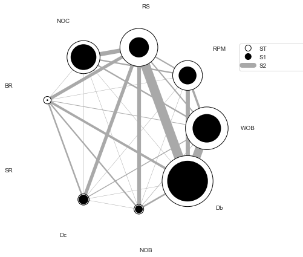

# Welcome to the Rate of Penetration (ROP) Modeling Webpage

I am Amin Atashnezhad, a Post-doctoral fellow at Oklahoma State University. I received my Ph.D. in chemical engineering in 2019 focusing on drilling rate of penetration modeling.
Last five years I have had the opportunity to dive deep into drilling engineering focusing on the drilling rate of penetration.
My Ph.D. dissertation entitles was "[Incorporating the interfacial friction angle into the full bit PDC ROP modeling](https://github.com/Atashnezhad/PhD_Dissertation)" which I developed a set of analytical equations to simulate the PDC ROP in hard rocks considering the single PDC cutter behavior into account.

On this webpage, the ROP models along with data from literature are provided.
The goal of this webpage is to gather the drilling rate of penetration models for both PDC and roller cone bits from literature and provide a blueprint for all students who are interested in the drilling engineering domain.

This is an open-source repository and collaborations are welcomed.

https://atashnezhad.github.io/Drilling-ROP-Modeling/

## [Akhtarmanesh et al. PDC ROP Model (2021)](https://github.com/Atashnezhad/ROP-Modeling/tree/main/Akhtarmanesh%20et%20al%20PDC%20ROP%20model)

This is an anlaytical model developed for hard rocks (geothermal wells). The model was used for ROP simulation using python language. The sensitivity analysis is provided in the following figure. The SALib library was used for sensitivity analysis.

  

## [Atashnezhad et al. PDC ROP Model (2020)](https://github.com/Atashnezhad/ROP-Modeling/tree/main/Atashnezhad%20et%20al%20PDC%20ROP%20model)

This is an analytical model developed for PDC bits considering the interfacial friction angle between a single PDC cutter into account. The model was developed by calculating the area in front of the single cutter and expanded to the whole PDC bit. In this case, the concept of the equivalent radius was used. The single cutter model was verified against the single cutter data achieved from Sandia National Lab while the full bit PDC model was verified using the data from the literature. Note that the Atashnezhad et al. (2019) model should be solved simultaneously with a single cutter model for ROP estimation. The developed codes are provided in the repository along with the data (hardcoded in the python language) from the literature.
