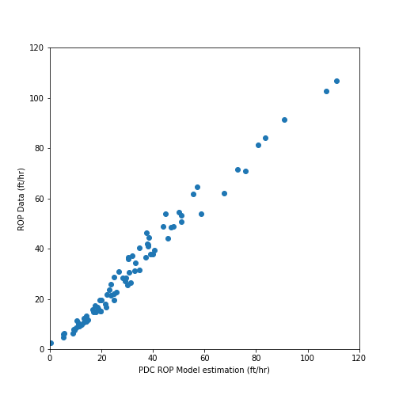
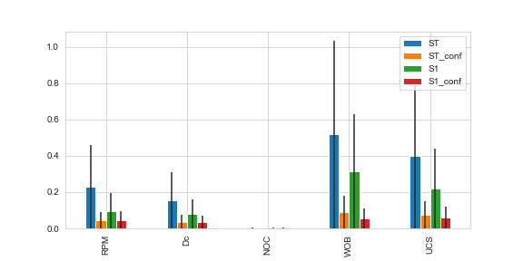
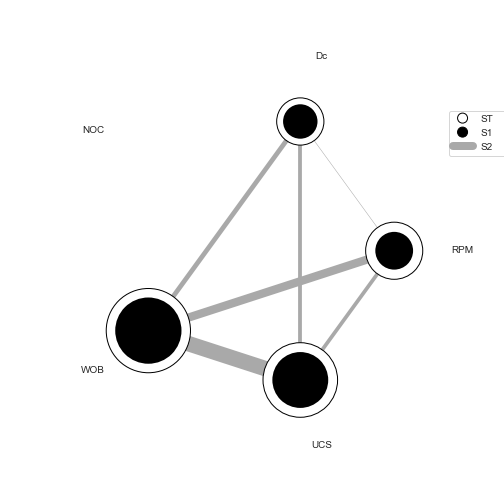

# Developing PDC ROP model using Artificial Intelligence

A PDC ROP model was developed using symbolic regression algorithm. 

* In this study, we use the Sandia National Lab and National Oil Varco full PDC bit data.
* The data was published in ARMA conference 55TH US ROCK MECHANICS / GEOMECHANICS SYMPOSIUM 18-25 June 2021 Online.
* Paper title is "ROP Model for PDC Bits in Geothermal Drilling". Please check out the Paper in the Paper folder.

### Symbolic Regression Algorithm


### Python library

The PySR library is used in this study. check out the PySR website [here](https://pysr.readthedocs.io/en/latest/docs/getting-started/).


### Repository structure

```
├───Archive
├───Data
├───Figures
├───Images
└───Paper
```

### Bits 


PDC bits manufactured by National Oil Varco - NOV (left) and Ulterra (right) are seen at the following image.
<p align="left">
  
  
</p>

### Data
The four-row of data used in this study are seen in the following table.

###### Table
```
|   year | name       |     WOB |   ROP data |   Db |   RPM |   UCS |   NOC |   BR |   SR |   Dc |   NOB |
|--------|------------|---------|------------|------|-------|-------|-------|------|------|------|-------|
|   2019 | SWG        | 2543.8  |    6.2     | 3.75 |    80 | 28000 |    11 |   25 |    1 | 0.51 |     4 |
|   2019 | SWG        | 3048.9  |   11.9     | 3.75 |    80 | 28000 |    11 |   25 |    1 | 0.51 |     4 |
|   2019 | SWG        | 3538.7  |   19.5     | 3.75 |    80 | 28000 |    11 |   25 |    1 | 0.51 |     4 |
|   2019 | SWG        | 4066.2  |   28.6     | 3.75 |    80 | 28000 |    11 |   25 |    1 | 0.51 |     4 |
```
###### Data Dimensions
```
WOB is in lbf
ROP data is in ft/hr
Db is in inch
RPM is in rpm
UCS is in psi
NOC is dimensionless
BR is dimensionless
Dc is in inch
NOB is dimensionless
```
### Results

The following equation was found using symbolic regression algorithm.
```
ROP = (pow((((((RPM + 98.457596) / Dc) * WOB) / (UCS - WOB)) - NOB) - NOC, 1.1348255) * 0.31298584)
```
The following figures compare the data versus above ROP model (found by AI).

<p align="left">
  
</p>

<p align="left">
  
</p>


<p align="left">
  
  
</p>


### Suggestions

* 

